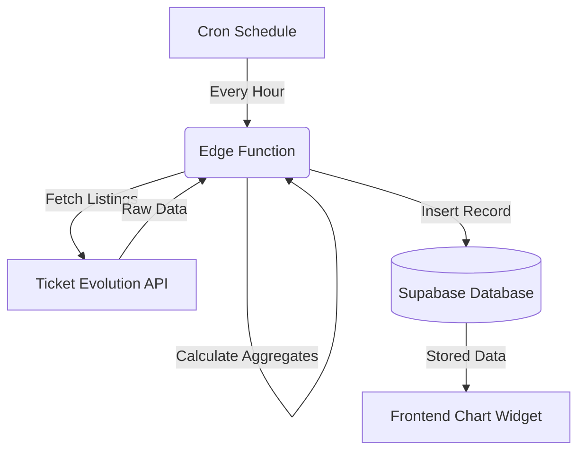

# Architecture

This document covers the system's data pipeline and storage layer — how ticket pricing data flows in and where it lives.

---

## Data Ingestion (Supabase Edge Functions)

The ingestion service runs in the background to fetch ticket pricing data and store it in the database. It is built on **Supabase Edge Functions** for secure, server-side execution.

### 1. Secure Data Fetching

The Ticket Evolution (TE) API requires a private API Secret and Token. Edge Functions keep these credentials server-side — they never appear in client code.

### 2. Price Aggregation

The TE API returns individual ticket listings. The Edge Function:

- Filters out non-ticket items (like parking passes).
- Calculates **Minimum**, **Average**, and **Maximum** prices for the event.
- Counts how many tickets are available.

### 3. Hourly Polling

A cron job triggers the Edge Function once per hour. It loops through all tracked events, fetches the latest prices, and inserts rows into the `event_price_hourly` table.

### 4. Daily Rollup

Once a day, another Edge Function summarizes the last 24 hours of hourly data into a single daily record per event. This keeps long-range charts fast and bounds storage growth.

### Pipeline Diagram

---

## Database Schema

Five tables store the system's data.

### Table: `events`

Master list of tracked events (one row per game/show).

- **`te_event_id`**: Primary key, sourced from the Ticket Evolution API.
- **`title`**: Event name (e.g., "Lakers vs Celtics").
- **`olt_url`**: Link to the event page on OnlyLocalTickets.
- **`polling_enabled`**: Whether the hourly poller actively collects prices for this event.
- **`starts_at`, `ends_at`, `ended_at`**: Scheduled and actual completion times.
- **`created_at`, `updated_at`**: Record timestamps.

### Table: `event_price_hourly`

Raw time-series data collected every hour (one row per event per hour).

- **`te_event_id`**: Foreign key to `events`.
- **`captured_at_hour`**: UTC hour bucket (e.g. `2026-06-15T14:00:00Z`).
- **`min_price`, `avg_price`, `max_price`**: Calculated price values.
- **`listing_count`**: Number of ticket listings available.
- **`created_at`**: When this snapshot was written.

### Table: `event_price_daily`

Summary table for the long-term (All-Time) chart view. One row per event per day, rolled up from hourly data.

- **`te_event_id`**: Foreign key to `events`.
- **`date`**: Calendar date of the summary.
- **`min_price`, `avg_price`, `max_price`**: Daily aggregated prices.
- **`samples`**: Number of hourly snapshots that contributed to the day's summary.

### Table: `poller_runs`

Tracks each execution of the hourly polling job.

- **`hour_bucket`**: UTC hour this run covers (acts as a run ID).
- **`status`**: Overall status (`started`, `succeeded`, `failed`).
- **`batch_size`**: Events processed concurrently per batch.
- **`events_total`, `events_processed`, `events_succeeded`, `events_failed`**: Counters for observability.
- **`started_at`, `finished_at`**: Run timestamps.
- **`error_sample`**, **`debug`**: Optional error/debug metadata.

### Table: `poller_run_events`

Per-event outcome for a given poller run (one row per event per hour).

- **`hour_bucket`**: Links to parent `poller_runs` row.
- **`te_event_id`**: Which event this row covers.
- **`status`**: `succeeded`, `failed`, or `skipped`.
- **`listing_count`**: Listings used to compute prices.
- **`min_price`, `avg_price`, `max_price`**: Prices calculated for this event in this hour.
- **`error`**: Error code or message when `status` is `failed` or `skipped`.
- **Skip diagnostics** (when `status = skipped`):
  - `raw_listing_count`: Total listings returned from TE API (before filtering).
  - `event_listing_count`: Listings after filtering to `type=event` with valid prices.
  - `quantity_match_count`: Listings after filtering to `available_quantity >= 1`.
  - `buyable_listing_count`: Listings after excluding non-buyable notes.
  - `skip_reason`: Structured reason (e.g. `no_te_listings`, `no_event_listings`, `no_valid_quantity`, `no_buyable_listings`).
- **`created_at`**: When this record was written.

### Relationships

- `event_price_hourly` and `event_price_daily` reference `events` via `te_event_id`.
- `poller_run_events` references `poller_runs` via `hour_bucket`. The composite key `(hour_bucket, te_event_id)` uniquely identifies each per-event result.

---

## RPC Functions

Custom database functions that run inside Supabase (PostgreSQL).

### `get_chart_data_hourly(p_te_event_id, p_hours_back)`

Fetches hourly prices for a specific event going back N hours (used for the 3-day view). Returns `recorded_at` timestamps and min/avg/max prices. Null metrics represent missing data (a gap), not zero.

### `get_chart_data_daily(p_te_event_id)`

Fetches every daily summary record for an event from `event_price_daily`. Returns `recorded_date` plus min/avg/max prices for the All-Time view. Null metrics are treated the same as in the hourly function.

### `get_24h_changes(p_te_event_id)`

Returns per-metric 24h percentage changes (min, avg, max) by comparing the latest hourly bucket to the bucket ~24 hours ago. Each change value can be null when no valid comparison exists.

### `get_current_prices(p_te_event_id)`

Returns the latest price snapshot plus per-metric 24h changes. Output: `min_price`, `avg_price`, `max_price`, `listing_count`, `last_updated`, `change_24h_min`, `change_24h_avg`, `change_24h_max`.

Note: the embed widget uses a **unified frontend display model** — chart, stat bar, and change badge all derive their values from the visible chart dataset (see `app/embed/src/utils/chartMetrics.js`). The stat bar shows the last valid value per metric from the displayed series, the badge computes percent change from the first/last valid values, and the chart renders null buckets as gaps. The `change_24h_*` fields remain available for compatibility and other consumers but are not used by the embed badge or stat bar.

### `rollup_hourly_to_daily()`

Aggregates hourly data into `event_price_daily`. Keeps long-term charts fast by summarizing older data into one row per day.

### `apply_ended_event_hourly_retention(p_retention_days integer default 7)`

Deletes old hourly rows for ended events only. Scheduled after `rollup_hourly_to_daily()` so cleanup never precedes daily aggregation.

---

## Security (RLS)

Row Level Security controls data access:

- **Public read**: Anyone can read prices (the chart works for all visitors).
- **Private write**: Only the service key (used by the ingestion Edge Functions) can insert or update price data.
