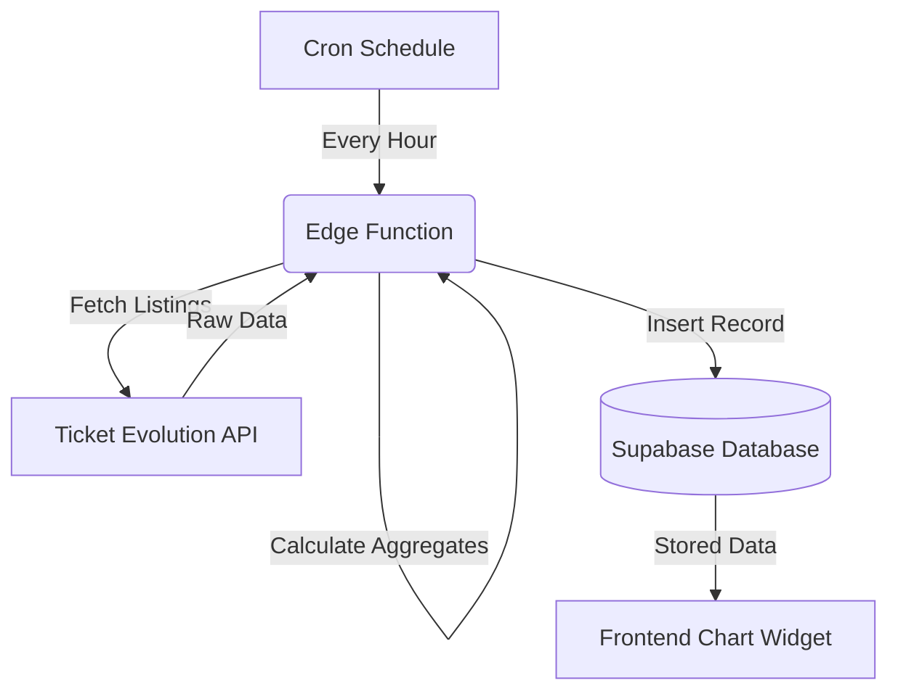

# Data Ingestion Service (Supabase Edge Functions)

The **Data Ingestion Service** is the "engine" of the system. It runs in the background to fetch ticket pricing data and store it in your database. 

We use **Supabase Edge Functions** for this because they are secure, scalable, and integrate perfectly with your database.

## What do Edge Functions do?

### 1. Secure Data Fetching (The Guard)
To get pricing data, we need to talk to the **Ticket Evolution (TE) API**. This requires using your private API Secret and Token.
- **Why Edge Functions?** You **never** want to put these API keys in your website's code (where anyone can see them). Edge Functions run on Supabase's servers, keeping your credentials completely hidden.

### 2. Price Aggregation (The Accountant)
The TE API gives us a long list of individual ticket listings. The Edge Function:
- Filters out non-ticket items (like parking passes).
- Calculates the **Minimum**, **Average**, and **Maximum** prices for the event.
- Counts how many tickets are available.

### 3. Hourly Polling (The Clock)
We need to capture prices every hour to build the historical chart.
- We set up a "Cron Job" (a scheduled task) that tells the Edge Function to run once per hour.
- It loops through your 104 events, fetches the latest prices, and saves them to the `event_price_hourly` table.

### 4. Daily Rollup (The Archivist)
Once a day, another Edge Function runs to:
- Take all the hourly data from the last 24 hours.
- Summarize it into a single "Daily" record.
- This keeps your "All-Time" charts fast and prevents your database from getting too cluttered with old hourly data.

---

## How it works (The Flow)

## Summary
The Edge Function is like a secure background worker that does all the "boring" but critical work of collecting and cleaning data so that the frontend chart always has fresh, accurate information to display.
